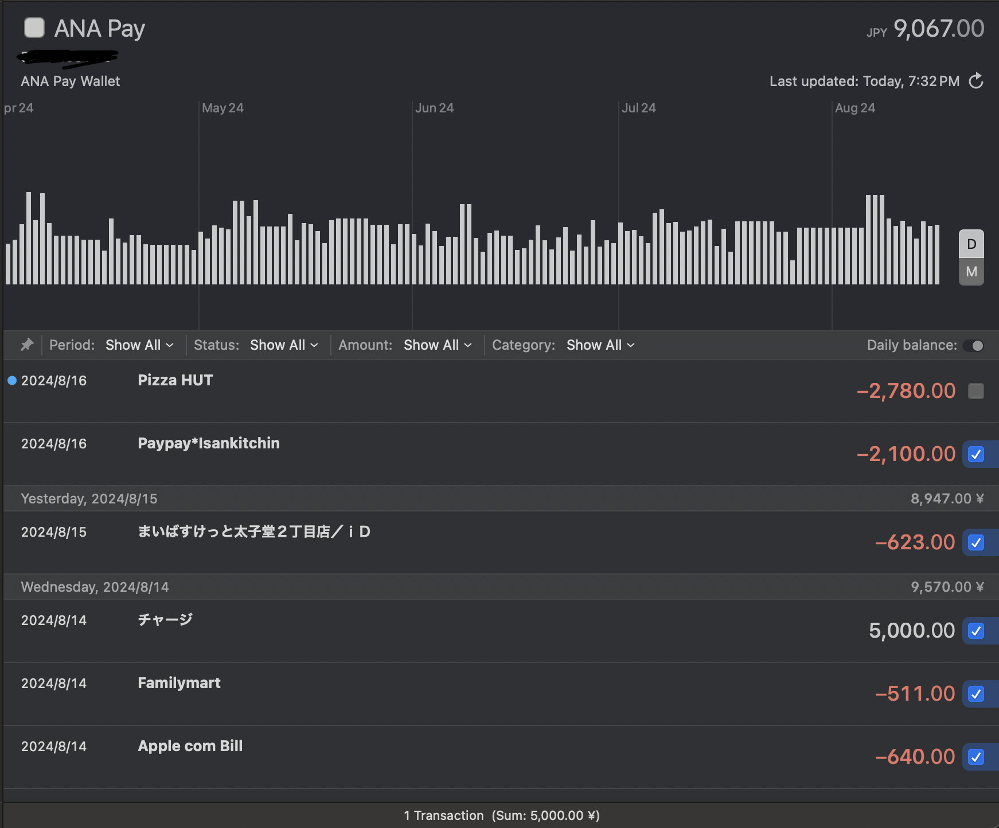

# ANA PAY Extension for MoneyMoney

Integrates [ANA PAY Wallet](https://www.ana.co.jp/ja/jp/amc/ana-pay/) into Money Money 

Caveat: I haven't got around to properly implement auth yet, so you need a reverse proxy to capture the token

## Usage 

1. In Money Money, open your extension folder (Help -> Show Database in Finder -> Extensions)
2. Download the latest release from [here](https://github.com/dvcrn/moneymoney-anapay-extension/releases)
3. Put the .lua file into your Extensions folder

## Authentication

As mentioned above, to get authentication working, you need to use a reverse proxy to capture the token (for now)

Look for the request to "teikei1.api.mkpst.com/ana/accounts/login" and copy `anaWalletId` and `deviceId`

In Money Money, setup a new connection of type "ANA Pay Wallet", username is `anaWalletId` and password is `deviceId`

## License 

MIT, with commercial use excluded